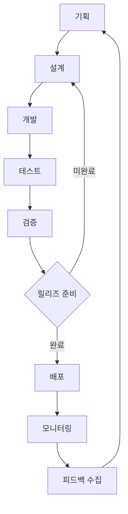

# Seoul Shadow Map - 개발 워크플로우

## 1. 전체 개발 사이클 (Macro Development Cycle)

### 1.1 프로젝트 단계별 개발 사이클



### 1.2 각 단계별 상세 프로세스

#### Phase 1: 기획 단계 (1주)

**담당**: Product Manager, 기획자
**산출물**: PRD, 기술 요구사항 정의서

**세부 작업**

- 사용자 요구사항 분석
- 경쟁사 분석 및 차별화 포인트 도출
- 기술 스택 검토 및 선정
- MVP 범위 정의
- 프로젝트 일정 수립

**완료 기준**

- [ ] PRD 문서 완성 및 승인
- [ ] 기술 스택 확정
- [ ] MVP 기능 목록 정의
- [ ] 개발 일정 확정

#### Phase 2: 설계 단계 (2주)

**담당**: 백엔드 개발자, 프론트엔드 개발자, DevOps 엔지니어
**산출물**: 시스템 아키텍처, API 설계서, 데이터베이스 스키마

**세부 작업**

- 시스템 아키텍처 설계
- API 엔드포인트 설계
- 데이터베이스 스키마 설계
- 3D 렌더링 아키텍처 설계
- 인프라 아키텍처 설계
- UI/UX 프로토타입 제작

**완료 기준**

- [ ] 시스템 아키텍처 다이어그램 완성
- [ ] API 명세서 완성
- [ ] 데이터베이스 스키마 확정
- [ ] UI/UX 프로토타입 승인
- [ ] 인프라 설계서 완성

#### Phase 3: 개발 단계 (6주)

**담당**: 전체 개발팀
**산출물**: 구현된 기능, 단위 테스트, 통합 테스트

**세부 작업**

- 백엔드 API 개발
- 프론트엔드 UI 개발
- 3D 렌더링 엔진 구현
- 그림자 계산 알고리즘 구현
- 데이터베이스 구축
- CI/CD 파이프라인 구축

**완료 기준**

- [ ] 모든 MVP 기능 구현 완료
- [ ] 단위 테스트 커버리지 80% 이상
- [ ] 통합 테스트 완료
- [ ] 코드 리뷰 완료
- [ ] 성능 기준 충족

#### Phase 4: 테스트 단계 (2주)

**담당**: 전체 개발팀
**산출물**: 테스트 리포트, 버그 수정

**세부 작업**

- 시스템 테스트
- 성능 테스트
- 보안 테스트
- 사용성 테스트
- 크로스 브라우저 테스트
- 모바일 환경 테스트

**완료 기준**

- [ ] 모든 테스트 케이스 통과
- [ ] 성능 기준 충족 확인
- [ ] 보안 취약점 해결
- [ ] 사용성 개선사항 반영

#### Phase 5: 검증 단계 (1주)

**담당**: Product Manager, 기획자
**산출물**: 검증 리포트, 개선 계획

**세부 작업**

- 내부 검수
- 베타 테스트
- 사용자 피드백 수집
- 성능 모니터링
- 최종 검증

**완료 기준**

- [ ] 요구사항 충족 확인
- [ ] 베타 테스터 피드백 반영
- [ ] 성능 지표 달성
- [ ] 출시 승인

#### Phase 6: 배포 단계 (1주)

**담당**: DevOps 엔지니어, 백엔드 개발자
**산출물**: 배포된 애플리케이션

**세부 작업**

- 프로덕션 환경 배포
- 모니터링 시스템 구축
- 로그 수집 시스템 구축
- 백업 시스템 구축
- 장애 대응 프로세스 수립

**완료 기준**

- [ ] 프로덕션 배포 완료
- [ ] 모니터링 시스템 구동
- [ ] 장애 대응 체계 구축
- [ ] 백업 시스템 가동

## 2. 개발 내 기능별 구현 순서 (Micro Development Cycle)

### 2.1 개발 우선순위 매트릭스

| 우선순위 | 기능                | 복잡도 | 의존성    | 예상 기간 |
| -------- | ------------------- | ------ | --------- | --------- |
| 1        | 기본 3D 지도 렌더링 | 높음   | 없음      | 2주       |
| 2        | 건물 데이터 로딩    | 중간   | 3D 지도   | 1주       |
| 3        | 태양 위치 계산      | 중간   | 없음      | 1주       |
| 4        | 기본 그림자 계산    | 높음   | 1,2,3     | 2주       |
| 5        | 시간 컨트롤 UI      | 낮음   | 3,4       | 1주       |
| 6        | 위치 정보 표시      | 낮음   | 1,2       | 1주       |
| 7        | 성능 최적화         | 높음   | 모든 기능 | 2주       |

### 2.2 Sprint 기반 개발 계획

#### Sprint 1: 기반 인프라 구축 (2주)

**목표**: 프로젝트 기반 환경 구축 및 기본 3D 렌더링

**백엔드 작업**

- [ ] 프로젝트 초기 설정
- [ ] 데이터베이스 스키마 구축
- [ ] 기본 API 엔드포인트 설정
- [ ] 건물 데이터 수집 및 전처리

**프론트엔드 작업**

- [ ] React + TypeScript 프로젝트 설정
- [ ] Three.js 기반 3D 씬 구축
- [ ] 기본 카메라 컨트롤 구현
- [ ] 지도 타일 로딩 시스템

**DevOps 작업**

- [ ] CI/CD 파이프라인 구축
- [ ] 개발 환경 Docker 컨테이너화
- [ ] 모니터링 기본 설정

**완료 기준**

- [ ] 3D 씬에서 기본 지도 표시
- [ ] 카메라 조작 (줌, 회전, 이동) 가능
- [ ] API 서버 정상 동작
- [ ] 자동 배포 파이프라인 구동

#### Sprint 2: 건물 3D 모델링 (2주)

**목표**: 서울시 건물 데이터를 3D로 시각화

**백엔드 작업**

- [ ] 서울시 공공데이터 API 연동
- [ ] 건물 데이터 정제 및 최적화
- [ ] 건물 지오메트리 생성 알고리즘
- [ ] 공간 인덱싱 (R-tree) 구현

**프론트엔드 작업**

- [ ] 건물 3D 지오메트리 렌더링
- [ ] LOD (Level of Detail) 시스템 구현
- [ ] 건물 클릭 이벤트 처리
- [ ] 건물 정보 팝업 UI

**성능 최적화**

- [ ] 지오메트리 인스턴싱
- [ ] 뷰포트 컬링 구현
- [ ] 메모리 사용량 최적화

**완료 기준**

- [ ] 서울시 주요 구역 건물 3D 표시
- [ ] 60fps 유지 (데스크톱 환경)
- [ ] 건물 클릭 시 상세 정보 표시
- [ ] 메모리 사용량 512MB 이하

#### Sprint 3: 태양 위치 및 그림자 계산 (2주)

**목표**: 정확한 태양 위치 계산 및 기본 그림자 알고리즘 구현

**백엔드 작업**

- [ ] 천문학적 태양 위치 계산 라이브러리 통합
- [ ] 서울 위치 기준 태양 경로 데이터 생성
- [ ] 그림자 계산 API 엔드포인트
- [ ] 시간대별 태양 위치 캐싱

**프론트엔드 작업**

- [ ] 태양 시각화 (디렉셔널 라이트)
- [ ] 그림자 맵 렌더링 (Shadow Mapping)
- [ ] 실시간 그림자 업데이트
- [ ] 시간 컨트롤 UI 구현

**알고리즘 작업**

- [ ] 레이 캐스팅 기반 그림자 계산
- [ ] 건물 간 그림자 상호작용
- [ ] 그림자 영역 폴리곤 생성

**완료 기준**

- [ ] 현재 시각 기준 정확한 그림자 표시
- [ ] 시간 변경 시 1초 이내 그림자 업데이트
- [ ] 그림자 계산 정확도 95% 이상
- [ ] 태양 위치 시각적 표현

#### Sprint 4: 사용자 인터페이스 고도화 (1주)

**목표**: 직관적이고 사용하기 쉬운 UI/UX 구현

**프론트엔드 작업**

- [ ] 반응형 레이아웃 구현
- [ ] 시간 선택 슬라이더 구현
- [ ] 재생/일시정지 컨트롤
- [ ] 위치 검색 기능
- [ ] 설정 패널 구현

**UX 개선**

- [ ] 로딩 상태 인디케이터
- [ ] 에러 상태 처리
- [ ] 투어 가이드 구현
- [ ] 키보드 단축키 지원

**완료 기준**

- [ ] 모든 주요 기능 UI 완성
- [ ] 모바일 환경 최적화
- [ ] 접근성 기준 충족
- [ ] 사용자 테스트 통과

#### Sprint 5: 고급 기능 및 최적화 (2주)

**목표**: 성능 최적화 및 고급 기능 구현

**성능 최적화**

- [ ] Web Worker를 활용한 백그라운드 계산
- [ ] 그림자 계산 결과 캐싱
- [ ] 3D 렌더링 최적화 (GPU 가속)
- [ ] 네트워크 요청 최적화

**고급 기능**

- [ ] 애니메이션 재생 기능
- [ ] 스크린샷 저장 기능
- [ ] 위치 북마크 기능
- [ ] 데이터 내보내기

**품질 보증**

- [ ] 크로스 브라우저 테스트
- [ ] 성능 프로파일링
- [ ] 메모리 누수 검사
- [ ] 부하 테스트

**완료 기준**

- [ ] 모든 대상 브라우저에서 정상 동작
- [ ] 성능 기준 달성
- [ ] 메모리 누수 없음
- [ ] 동시 사용자 1000명 지원

#### Sprint 6: 테스트 및 배포 준비 (1주)

**목표**: 최종 테스트 및 프로덕션 배포 준비

**테스트 작업**

- [ ] 통합 테스트 수행
- [ ] 사용자 시나리오 테스트
- [ ] 보안 테스트
- [ ] 성능 테스트

**배포 준비**

- [ ] 프로덕션 환경 설정
- [ ] 도메인 및 SSL 인증서 설정
- [ ] CDN 설정
- [ ] 백업 및 복구 시스템

**문서화**

- [ ] 사용자 가이드 작성
- [ ] API 문서 업데이트
- [ ] 운영 매뉴얼 작성
- [ ] 트러블슈팅 가이드

**완료 기준**

- [ ] 모든 테스트 통과
- [ ] 프로덕션 환경 구축 완료
- [ ] 문서 작성 완료
- [ ] 출시 승인

## 3. 개발 방법론 및 도구

### 3.1 애자일 개발 방법론

#### 스크럼 프로세스

- **Sprint 길이**: 2주
- **Daily Standup**: 매일 오전 9:30
- **Sprint Planning**: 매 Sprint 시작일
- **Sprint Review**: 매 Sprint 마지막일
- **Sprint Retrospective**: Sprint Review 후

#### 백로그 관리

- **Product Backlog**: Jira 또는 Linear 사용
- **User Story 형식**: "As a [user], I want [goal] so that [benefit]"
- **Story Points**: 피보나치 수열 사용 (1, 2, 3, 5, 8, 13)
- **Definition of Done**: 체크리스트 형식으로 정의

### 3.2 코드 리뷰 프로세스

#### Pull Request 워크플로우

```
feature/branch → develop → staging → main
     ↓              ↓         ↓       ↓
   Unit Test   Integration  E2E Test  Production
                  Test                 Deploy
```

#### 코드 리뷰 체크리스트

- [ ] 기능 요구사항 충족
- [ ] 코드 스타일 가이드 준수
- [ ] 테스트 케이스 포함
- [ ] 성능 영향 검토
- [ ] 보안 취약점 검사
- [ ] 문서 업데이트

### 3.3 테스트 전략

#### 테스트 피라미드

```
    🔺 E2E Tests (10%)
   🔺🔺 Integration Tests (20%)
  🔺🔺🔺 Unit Tests (70%)
```

#### 테스트 도구

- **Unit Test**: Jest, React Testing Library
- **Integration Test**: Supertest (API), Cypress (Frontend)
- **E2E Test**: Playwright
- **Performance Test**: Lighthouse, WebPageTest
- **Visual Regression**: Percy, Chromatic

## 4. 리팩토링 전략

### 4.1 리팩토링 우선순위

#### 1차 리팩토링 (기능 완성 후)

- **목적**: 코드 품질 개선 및 기술 부채 해결
- **대상**: 중복 코드, 복잡한 함수, 네이밍 개선
- **시기**: 각 Sprint 완료 후

#### 2차 리팩토링 (MVP 완성 후)

- **목적**: 성능 최적화 및 아키텍처 개선
- **대상**: 알고리즘 최적화, 메모리 사용량 개선
- **시기**: MVP 출시 전

#### 3차 리팩토링 (운영 중)

- **목적**: 확장성 및 유지보수성 개선
- **대상**: 모듈화, 설계 패턴 적용
- **시기**: 사용자 피드백 반영 시

### 4.2 리팩토링 가이드라인

#### 안전한 리팩토링 원칙

1. **작은 단위로 진행**: 한 번에 하나의 변경사항만
2. **테스트 우선**: 리팩토링 전 테스트 코드 작성
3. **단계적 적용**: 점진적으로 변경사항 적용
4. **롤백 계획**: 문제 발생 시 빠른 롤백 가능

#### 리팩토링 체크리스트

- [ ] 기존 기능 동작 확인
- [ ] 테스트 케이스 작성/업데이트
- [ ] 성능 영향 측정
- [ ] 코드 리뷰 수행
- [ ] 문서 업데이트

## 5. 품질 관리

### 5.1 코드 품질 지표

#### 정적 분석 도구

- **ESLint**: JavaScript/TypeScript 코딩 표준
- **Prettier**: 코드 포맷팅
- **SonarQube**: 코드 품질 분석
- **TypeScript**: 타입 안정성

#### 품질 기준

- **테스트 커버리지**: 80% 이상
- **복잡도**: Cyclomatic Complexity 10 이하
- **중복률**: 3% 이하
- **기술 부채**: SonarQube Grade A 이상

### 5.2 성능 모니터링

#### 성능 지표

- **응답 시간**: API 평균 응답 시간 2초 이하
- **렌더링 성능**: 60fps 유지
- **메모리 사용량**: 브라우저 512MB 이하
- **번들 크기**: 초기 로딩 5MB 이하

#### 모니터링 도구

- **Frontend**: Google Analytics, Sentry
- **Backend**: New Relic, DataDog
- **Infrastructure**: Prometheus, Grafana

## 6. 위험 관리

### 6.1 기술적 위험 요소

#### 높은 위험도

- **3D 렌더링 성능**: 복잡한 지오메트리로 인한 성능 저하
- **대용량 데이터**: 서울시 전체 건물 데이터 처리
- **브라우저 호환성**: WebGL 지원 차이

#### 대응 방안

- **성능 테스트**: 지속적인 성능 모니터링
- **폴백 전략**: WebGL 미지원 브라우저 대응
- **점진적 로딩**: 필요한 데이터만 순차적 로딩

### 6.2 일정 위험 관리

#### 위험 신호

- Sprint 목표 달성률 80% 미만
- 버그 발견률 증가
- 테스트 커버리지 감소

#### 대응 전략

- **범위 조정**: 핵심 기능 우선 개발
- **리소스 재배치**: 병목 구간 리소스 집중
- **외부 지원**: 필요 시 외부 개발자 투입

## 7. 개발 환경 및 도구

### 7.1 개발 환경 설정

#### 로컬 개발 환경

```bash
# 프로젝트 클론
git clone [repository-url]
cd seoul-shadow-map

# 의존성 설치
npm install

# 환경 변수 설정
cp .env.example .env.local

# 개발 서버 실행
npm run dev

# 테스트 실행
npm run test

# 빌드
npm run build
```

#### Docker 개발 환경

```bash
# Docker 컨테이너 실행
docker-compose up -d

# 로그 확인
docker-compose logs -f

# 컨테이너 정지
docker-compose down
```

### 7.2 협업 도구

#### 커뮤니케이션

- **Slack**: 일상적인 커뮤니케이션
- **Zoom**: 화상 회의
- **Notion**: 문서 공유 및 wiki

#### 프로젝트 관리

- **Jira**: 이슈 트래킹 및 스프린트 관리
- **Confluence**: 문서 관리
- **GitHub**: 코드 저장소 및 CI/CD

#### 설계 및 기획

- **Figma**: UI/UX 디자인
- **Miro**: 브레인스토밍 및 플로우차트
- **Draw.io**: 시스템 아키텍처 다이어그램

이상으로 Seoul Shadow Map 프로젝트의 전체 개발 워크플로우를 정의했습니다. 이 워크플로우를 따라 체계적이고 효율적인 개발을 진행할 수 있을 것입니다. 1: 기획 단계 (1주)
**담당**: Product Manager, 기획자
**산출물**: PRD, 기술 요구사항 정의서

**세부 작업**

- 사용자 요구사항 분석
- 경쟁사 분석 및 차별화 포인트 도출
- 기술 스택 검토 및 선정
- MVP 범위 정의
- 프로젝트 일정 수립

**완료 기준**

- [ ] PRD 문서 완성 및 승인
- [ ] 기술 스택 확정
- [ ] MVP 기능 목록 정의
- [ ] 개발 일정 확정

#### Phase 2: 설계 단계 (2주)

**담당**: 백엔드 개발자, 프론트엔드 개발자, DevOps 엔지니어
**산출물**: 시스템 아키텍처, API 설계서, 데이터베이스 스키마

**세부 작업**

- 시스템 아키텍처 설계
- API 엔드포인트 설계
- 데이터베이스 스키마 설계
- 3D 렌더링 아키텍처 설계
- 인프라 아키텍처 설계
- UI/UX 프로토타입 제작

**완료 기준**

- [ ] 시스템 아키텍처 다이어그램 완성
- [ ] API 명세서 완성
- [ ] 데이터베이스 스키마 확정
- [ ] UI/UX 프로토타입 승인
- [ ] 인프라 설계서 완성

#### Phase
